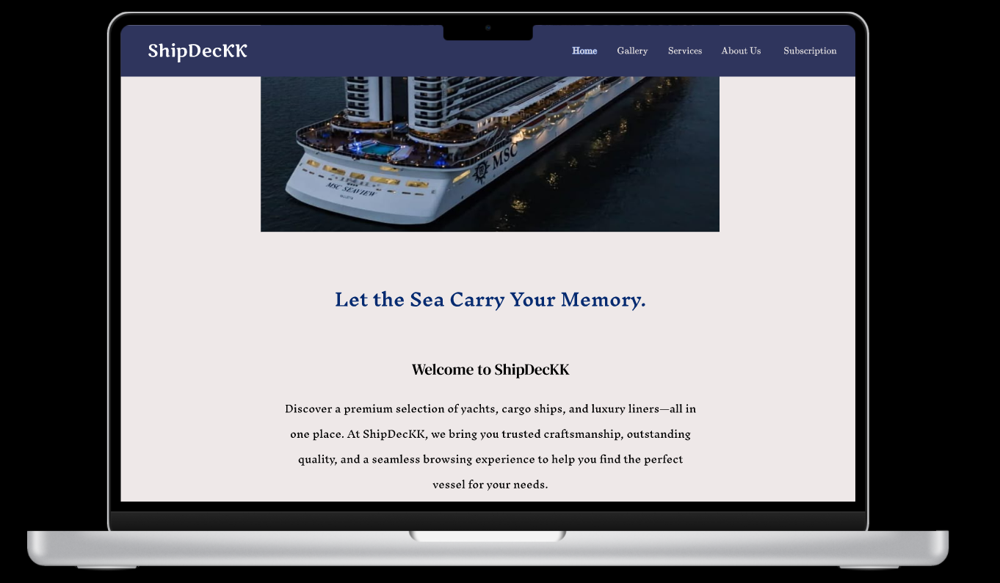
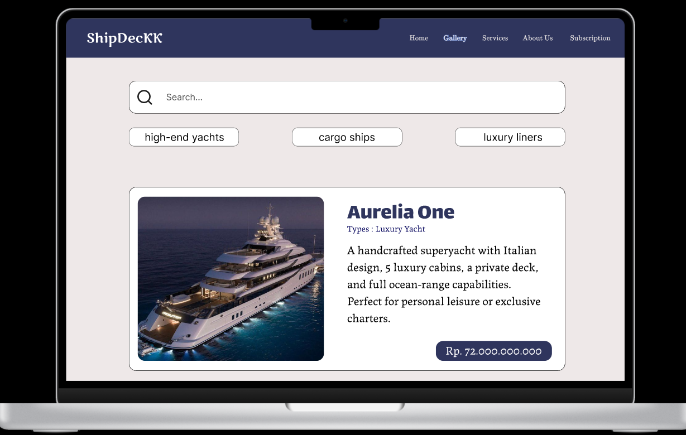
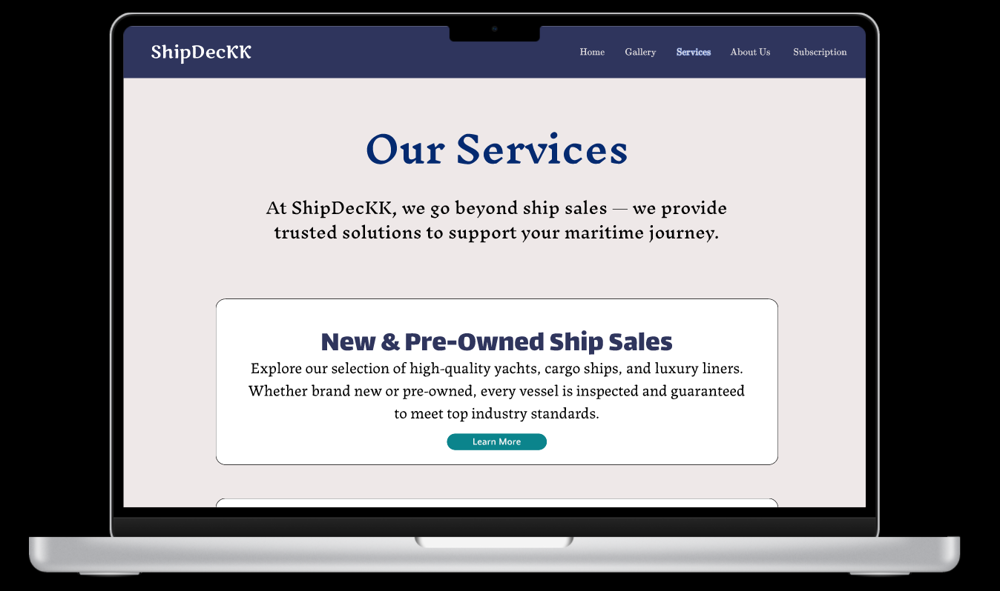
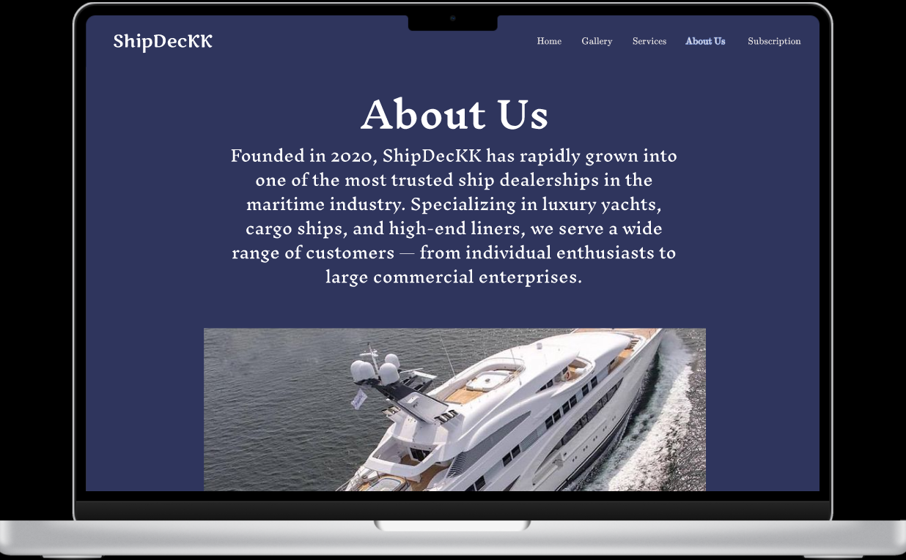
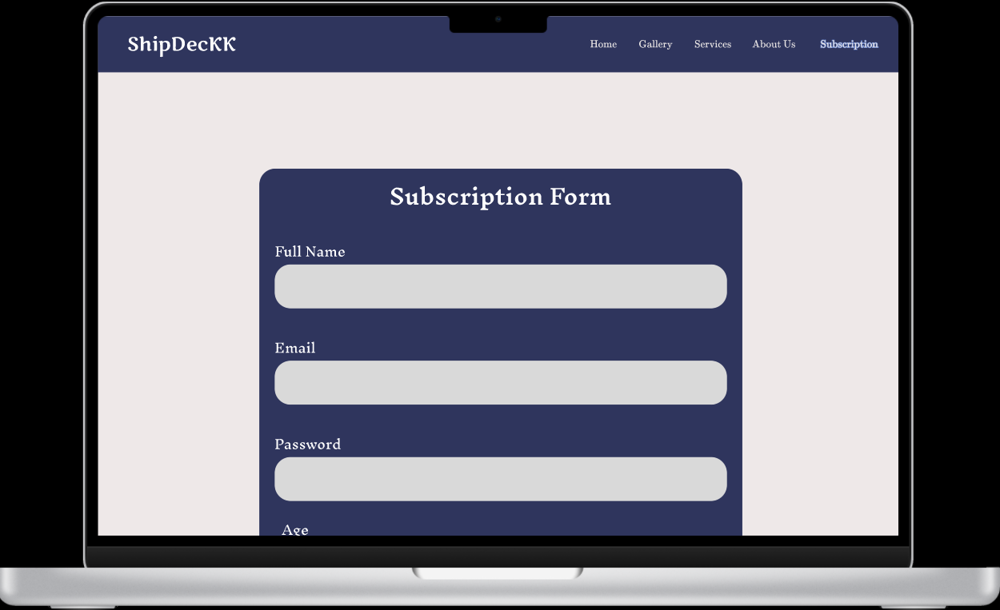

# ⚓ ShipDecKK – Responsive Ship Trading Website  

This project was created as part of a web development learning project. **ShipDecKK** is a responsive website concept for buying and selling ships, designed with a focus on **usability, accessibility, and responsiveness**.  
The website was first prototyped in **Figma** and then implemented using **HTML, CSS, and JavaScript**.  

---

## ✨ Features  

- 🏠 **Home** – Introduction to ShipDecKK, highlighting that we specialize in selling ships.  
- 🛳️ **Gallery** – Showcase of available ships along with their details and prices.  
- ⚙️ **Services** – Overview of the services we provide, from ship sales to maritime solutions.  
- 📖 **About Us** – Background and history of our business.  
- 📨 **Subscription Form** – A membership sign-up form for customers who want access to ship purchases and exclusive deals.  
- 🎨 **Design First in Figma** – Prototyped in Figma before implementation in code.  

---

## 🛠️ Tech Stack  

- **Frontend**: HTML, CSS, JavaScript  
- **Design**: Figma  
- **Assets**: Images, icons, and other media for ships and branding  

---

## 📷 Screenshots  
### 🏠 Homepage  
  

### 🛳️ Gallery  
  

### ⚙️ Services  
  

### ⚙️ About Us 
  

### ⚙️ Subscription 
  

---

## 👩‍💻 Author Note  

ShipDecKK is currently a **concept prototype** and not yet a fully functional e-commerce platform. The project demonstrates how responsive design and clean UI/UX principles can be applied to a **maritime-focused business website**.  
